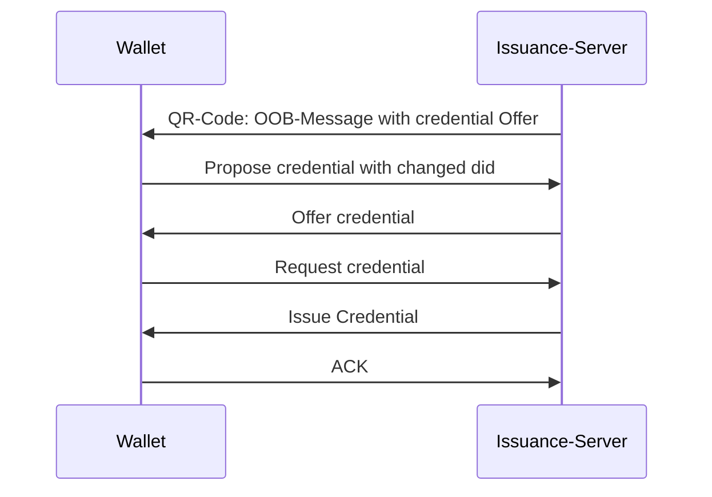

# Issuance at didcomm level (Ideal flow)
This happens in background, after the user has scanned the QR-Code.

**Note**: The First offer-credential message is not embedded direcly in the QR-Code. Here, the link property of a Didcomm attachment is used. So the wallet must request the message from the server directly using http-get
