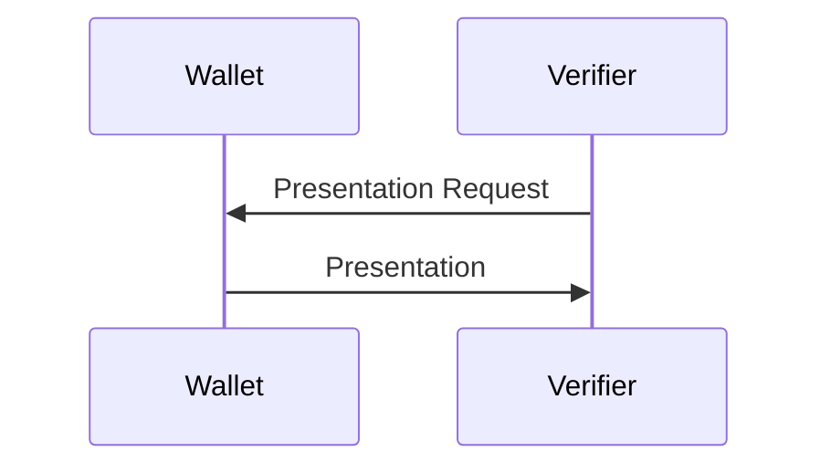

# Demonstrator 1 aus N - Abfragen
- genauer X aus N

## Beispiel: Ausstellen des Dresden-Passes
akzeptierte Credentials:
- Hilfe zum Lebensunterhalt/Grundsicherung im Alter und bei Erwerbsminderung nach SGB XII
- ALG2/Sozialgeld nach SGB II
- Wohngeld
- Kinderzuschlag
- Barbetrag nach §§39,40 Kinder- und Jugendhilfegesetz
- Leistungen nach AsylbLG

## Ablauf

- es wird eine Anfrage nach DidcommV2-Spezifikation und DIF Presentation Exchange codiert
- aktuell wird ein komplettes Credential basierend auf dessen Typ abgefragt
- später: Abfrage und Kombination einzelner Attribute möglich
